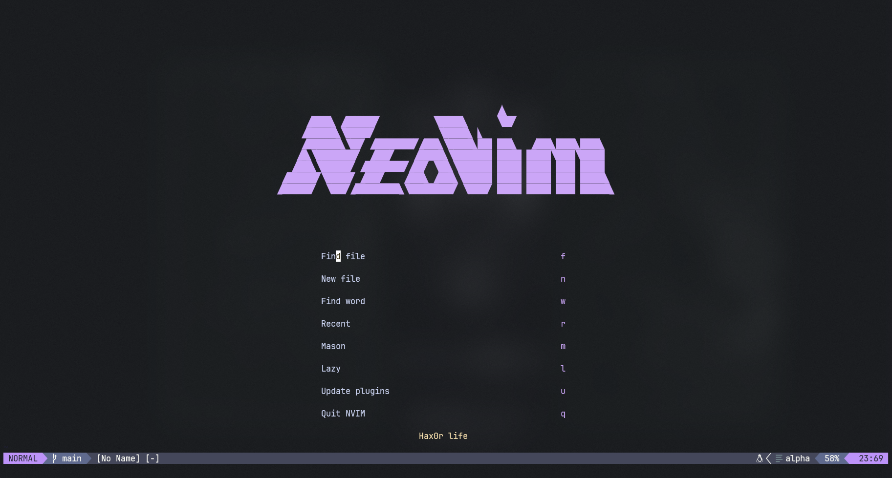
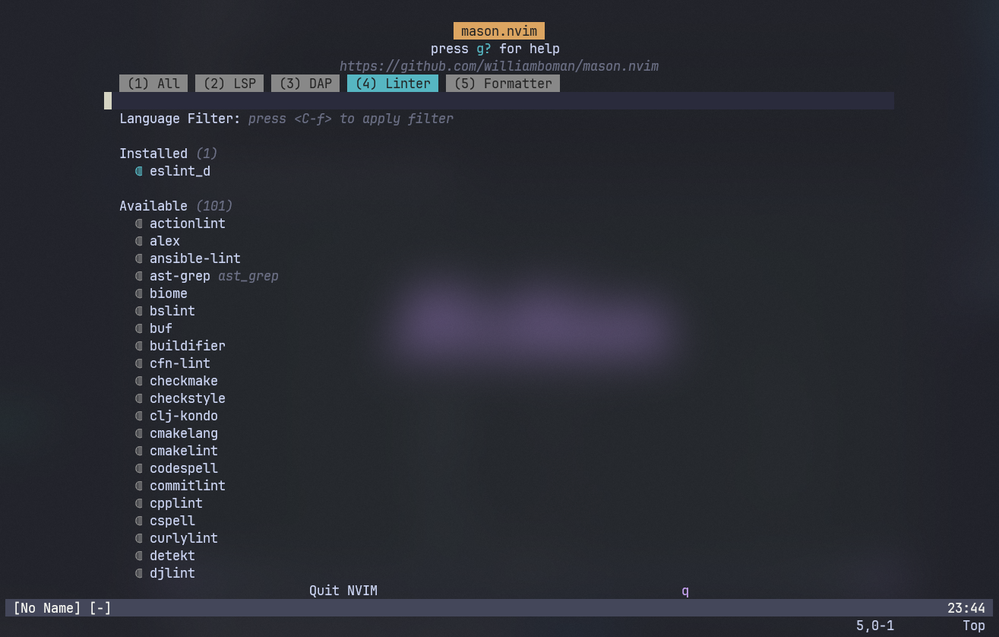

# Neovim



## Índice

- [Pré-requisitos](#pré-requisitos)
- [Instalação](#instalação)
- [Utilização](#utilização)
- [Contribuição](#contribuição)
- [Contato](#contato)

## Pré-requisitos

- [Neovim](https://neovim.io/)

## Instalação

1. Clone o repositório para seu ambiente local:

```
git clone https://github.com/Wallauerr/nvim.git && mv nvim .config
```

2. Inicie o neovim:

```
nvim
```

3. Dentro do neovim instale o `eslint_d` e o `prettier` via Mason:




## Utilização

1. Abrir tree files: `ctrl + n`
2. Abrir ou fechar terminal `space + ot`
3. Navegar entre janelas `ctrl + h,j,k,l` 

## Contribuição

Siga as etapas abaixo para contribuir com este projeto:

1. Dê um fork este repositório.
2. Crie uma nova branch com sua feature/correção:

```
git checkout -b nome-da-sua-branch
```

3. Realize as alterações e commits:

```
git commit -m "tipoDeModificação: Descrição das suas alterações"
```

Tipos de modificação: feat, fix, etc...

4. Envie as alterações para o fork do repositório:

```
git push origin nome-da-sua-branch
```

5. Abra um Pull Request neste repositório (original).

## Contato

Se tiver alguma dúvida ou sugestão, você pode entrar em contato comigo por meio do email: wallauer@protonmail.com
