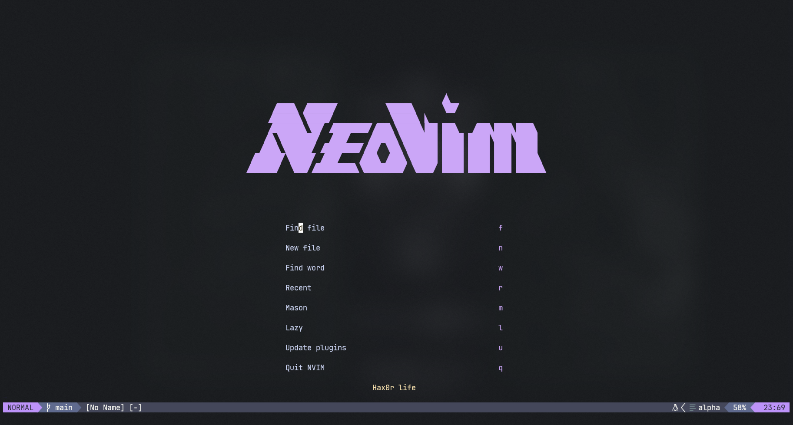
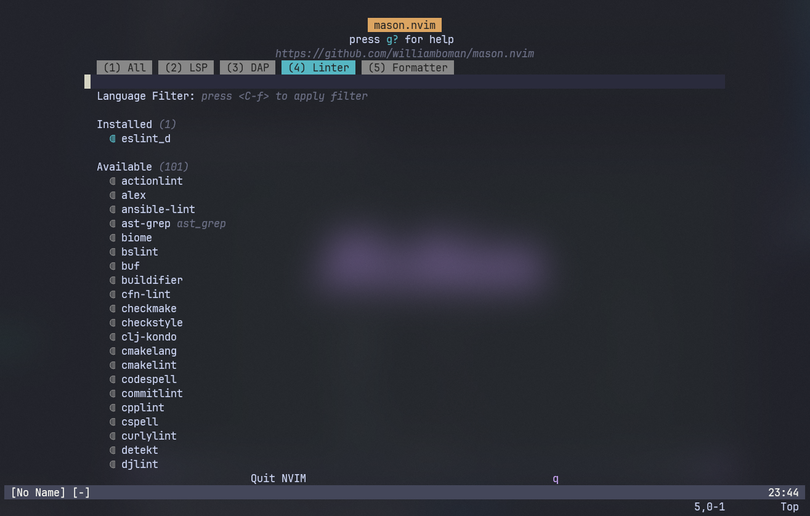

# Neovim

## Índice

- [Pré-requisitos](#pré-requisitos)
- [Instalação](#instalação)
- [Utilização](#utilização)

## Pré-requisitos

- [Neovim](https://neovim.io/)

## Instalação

1. Dentro do neovim instale o `eslint_d` e o `prettier` via Mason:

## Utilização

1. Abrir tree files: `ctrl + n`
2. Abrir ou fechar terminal `space + ot`
3. Navegar entre janelas `ctrl + h,j,k,l` 
