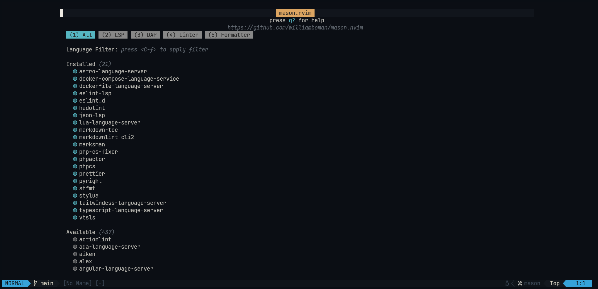

# 💤 LazyVim

## Índice

- [Pré-requisitos](#pré-requisitos)
- [Instalação](#instalação)
- [Comandos](#comandos)

## Pré-requisitos

- [NeoVim](https://neovim.io/)
- [LazyGit](https://github.com/jesseduffield/lazygit)
- [NerdFont](https://www.nerdfonts.com/font-downloads): Para melhor experiência, recomenda-se o uso de uma Nerd Font, como a `JetBrainsMono Nerd Font`, para conseguir visualizar os ícones corretamente

## Instalação

1. Instale o `lazygit` e configure um `alias`(opcional) nas configurações do seu terminal:

2. Dentro do neovim instale os pacotes via Mason:

## Comandos

- [Key Maps](https://www.lazyvim.org/keymaps)
