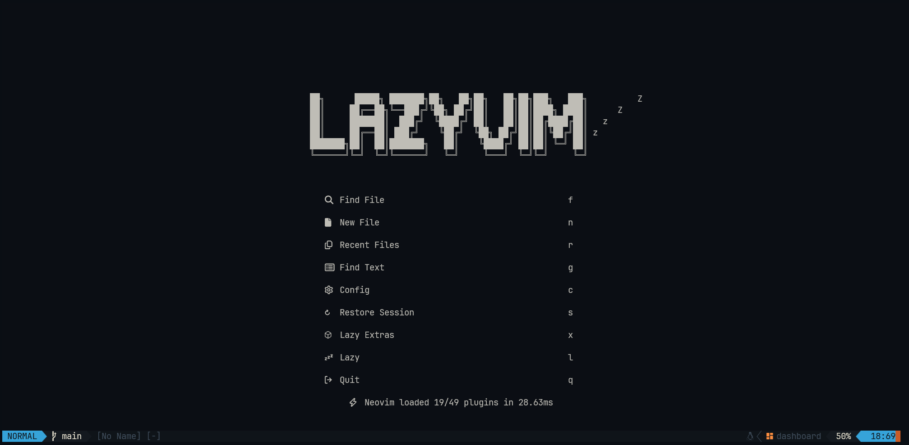
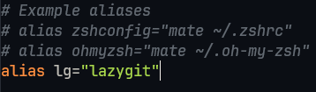

# 💤 LazyVim

## Prerequisites

- [NeoVim](https://neovim.io/)
- [LazyGit](https://github.com/jesseduffield/lazygit)
- [NerdFont](https://www.nerdfonts.com/font-downloads): For the best experience, it's recommended to use a Nerd Font, such as `JetBrainsMono Nerd Font`, to properly display icons
- [RipGrep](https://github.com/BurntSushi/ripgrep?tab=readme-ov-file#installation): Optional, but highly recommended, `ripgrep` removes directories like `node_modules` from the `Find Files (space + space)` function within neovim.
- [Xclip](https://terminalroot.com.br/2020/10/copie-e-cole-via-linha-de-comando-do-linux-com-xclip.html): Optional, but highly recommended, `xclip` allows copying and pasting content via command line.

## Installation

1. Install `lazygit` and configure an `alias` (optional) in your terminal settings:

## Commands

- [Key Maps](https://www.lazyvim.org/keymaps)